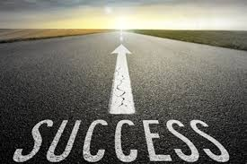

layout: posts
title: (نتیجه مصاحبه با ترم بالایی ها)
---

## Mosahebe movaffaqiyat.

---
**Result**

: نتیجه مصاحبه با آقایان (توحید عابدینی و مهدی جاوید)
1.علاقه و پشتکار مهم ترین فاکتور موفقت
برای موفق شدن در هر رشته ای باید علاقه توام با پشتکار فراوان باشد. اگر علاقه و پشتکار زیاد داشته باشی مطمن باش از   لحاظ جایگاه و در آمد شرایط خوبی خواهی داشت   

 	2.دوران کارشناسی را چطور بگذرانیم
به طور خلاصه این افراد گفتند که در این 4 سال بیشتر وقت بزار برای درس های اختصاصی رشتت و درس های عمومی رو در طول هفته فقط 2 روز وقت بزار چون اینا تموم میشه و تنها درس های اختصاصی میماند و این درس ها است که به کار شما می اید

3. رمز موفقیت چیست؟ 
موفق ها در کلاس همیشه فعال بوده و در بحث های گروهی شرکت می کنند. اگر مطلبی را متوجه نشده اند مرتبا از استاد سوال می پرسند تا مطالب را در همان کلاس یاد بگیرند. حتما در هر مبحثی که استاد تدریس می کند خوب گوش کنید، جزوه بنویسید و سوال بپرسید

