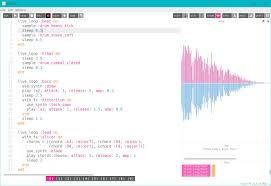

layout: posts
title:(My first project with sonic pi)
---

## sonic pi(music)

---
**My first music with sonic pi**
<audio controls>
    <source src = "../assets/music/ali.mp3" type = "audio/mp3">
</audio>
  

* به نام خدا *  
طی آموزش هایی که با دو نفر از اساتید این حوزه داشتیم توانستیم از طریق کد زدن و آشنایی با نحوه کار کرد سونیک پای آهنگی را هر چند مبتدی تولید کنیم.
شاید علم دارد به سمتی حرکت می کند که در آینده شاهد ظهور آهنگ هایی ناب از طریق کد زنی خواهیم بود. و سونیک پای یکی از بهترین اپ ها در   این زمینه می باشد که میتوانیم  از سمپل ها و نوت های فراوانی استفاده کنیم. سونیک پای هاوی لوپ هایی هست که میتوانیم به وسیله آن ریتم جذابی به آهنگ بدهیم. خلاصه سونیک پای تجربه خوبی برای شخص بنده بود. و من این برنامه نه چندان سخت را برای همه توصیه میکنم چرا که می تواند اوقات فراغت را به خوبی پر کند یا از طریق آن در آمد زایی کلانی داشته باشد.
ممنون از همراهی شما عزیزان. 
